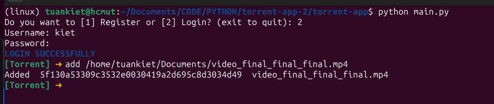
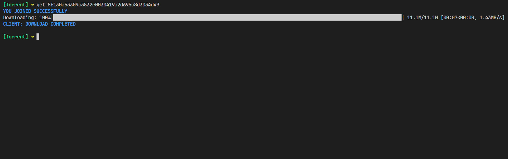
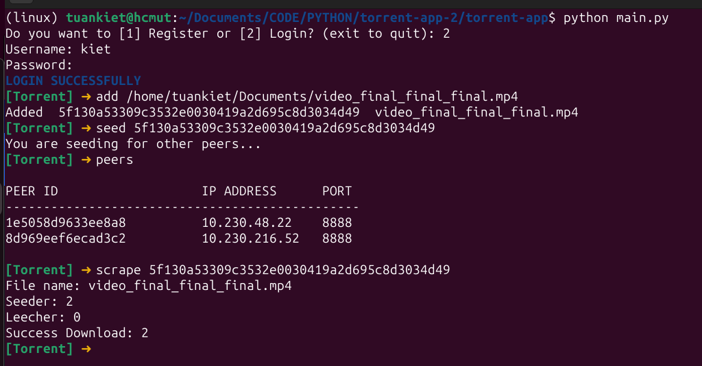

# Torrent-app

Build and developed a CLI torrent app enabling simultaneous file sharing and downloading. Files were split into multiple pieces and distributed concurrently across clients in the network. This repo associate with tracker repo.

## Available Commands:
    -------------------------
    - add                 : Publish your documents into network
    - delete  <code>      : Delete your published documents
    - ls                  : List all your published documents 
    - seed    <code>      : Start sharing your documents 
    - get     <code>      : Start downloading documents
    - stop    <code>      : Stop downloading/sharing documents 
    - show                : Show all progress of download
    - peers   <code>      : List all peers you are connecting 
    - scrape  <code>      : Check currrent infomation of torrent network
    - help                : Display available commands
    - clear               : Clear the screen
    - logout              : Log out your account 
    - exit                : Exit the program


## User manual
First, you go to **dist** folder, double click on *window.exe* if you are on Window or run command *./linux* if you are on Linux
1. Login or create your account 
2. Copy link of your document you want to share 
3. Using 'add' command to start seeding, share your magnet code for your friend so they can get your document.

4. On another computer in the same LAN network, people using 'get' command to get document with magnet code

5. The document transfers successfully and is stored in './dist/dist'
6. You can use other command to check torrent network 



## Virtual environment setup and run project
Create venv
```sh
python -m venv venv
```
Active venv for window
```sh
venv\Scripts\activate
```
Active for Linux/MacOS
```sh
source venv/bin/activate
```
Install dependencies
```sh
pip install -r requirements.txt
```
Run project 
```sh
python main.py
```
**Notice**: you need create a `.env` file with all variable in `.env.example` but with actual value, you also need a tracker server for everything go well 


## Project structure

```py
📦src
 ┣ 📄 .env.example                  # all environment variables in program
 ┣ 📄 add_delete_ls.py              # add + delete + ls command
 ┣ 📄 auth.py                       # login + register command 
 ┣ 📄 config.py                     # Load environment variable 
 ┣ 📄 fetch_api.py                  # fetch + post + delete API function
 ┣ 📄 get_seed_peers.py             # get + seed + peers commands  
 ┣ 📄 scrape.py                     # scrape command
 ┣ 📄 show.py                       # show command 
 ┣ 📄 upload.py                     # Upload algorithm 
 ┣ 📄 download.py                   # download handler
 ┣ 📄 state.py                      # current state of peer              
 ┣ 📄 requirement.txt               # all libraries and version for this program  
 ┗ 📜 main.py                       # main file to run program
```
